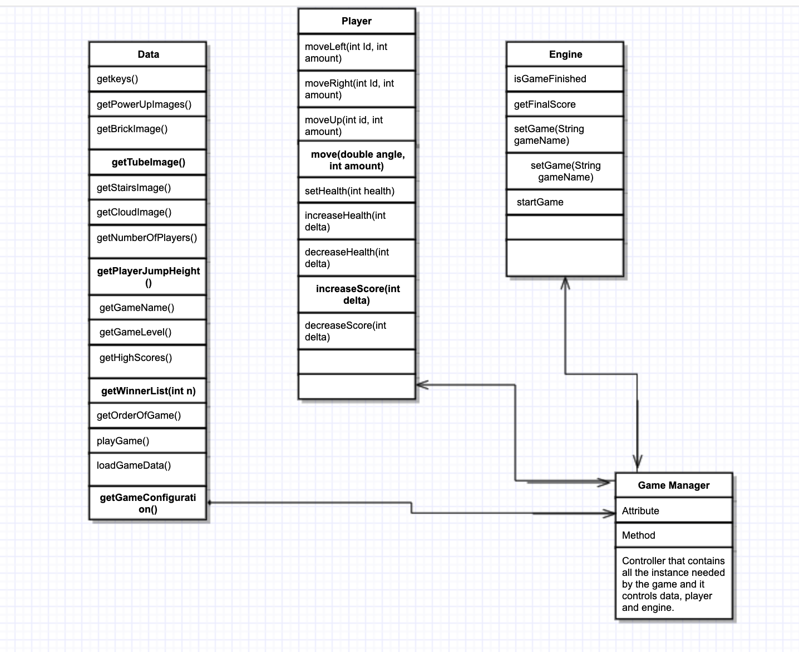

#Design Plan

## Duballers (14): Abebe Amare(ama100), Ryan Weeratunga (rkw14), Achilles Dabrowski (ajd66), Franklin Boampong(fsb10), Alex Xu (aqx), Vineet Alaparthi (va68)

### Introduction
In this project, we are planning to design Super Mario and Doodle Jump games. The main goal is to make the project as flexible as possible to enhance easy extension to other scrolling games as well. The high-level design of the project can be broken into an engine, a player and the data for the player. The main design implementation will make use of the MVC model where the front-end is independent from the controller and the controller serves as the main interface between the frontend and backend. 
### Overview

The main structure of our program is that there is one GameManager class that acts as the controller and
 communicates between the front end and back end. The GameManager have the instance of the data, the player, and the
  engine APIs and it facilitates the interaction between these APIs. The data will load all the necessary data that
   the engine and the player uses and its data will be transferred to player and engine through the gameManager. In
    addition to that, the data assembles the entities of the engine that are needed by the game based on the
     configuration file. On
    the other hand, engine has all the entities and logic that drives the interaction between those entities. The
   Player API will be
   implemented in the
   front
   end and this will manage the appearance of the game launcher, specific game introduction screen, and the 
 actual gameplay window. The logic behind organizing our project this way is motivated to make the interaction
  between each APIs easier to manage and detect any changes that the entities encounter using a general controller.
  The
   API interaction
  and data
  flow is
  shown in the following UML sketch.

### Design Details
The project will implement the Model-View model approach for this assignment. 

In the front end of this project, we will implement a data driven GUI to organize the appearance of each window. In the properties file, each scene will have a list of what components or objects will be attached to the scene. By using reflection and another properties file acting as a map, the user will have the ability to customize what objects appear in the runtime of the program. We will also use another properties file for labels used in the GUI so that our program is not only dependent on English-speaking users. The images loaded, description, rules, and commands will be read from the xml file, which will be received from the controller. The controller will receive this information from the Data API. 

The controller class, GameManager, will act as a mediator between the front end and back end. It consists of multiple listeners and will pass in values from one side to the other. The controller will also be utilized to conduct bindings. 

The game engine (Backend) is responsible for handling all game interactions and running the game itself. The game
 engine requires loading all of the data it needs from the Data component of the program, which acquires the data 
 from the game's specific configuration files). When the game is played, 
 the game engine coordinates several different sub-components to make 
 sure that the game runs as expected. Among them, there is the Physics engine, which
  controls physical aspects of the game such as gravity. In the future,
   feature updates to the game engine can be made as well (to add features
    such as buoyancy). In addition, there is the character rules engine subcomponent,
     which dictates how the user-controlled character behaves and moves based on a set
      of defined keyboard controls. There are also object engines and non-player
       character (NPC engines), which control how these elements of the game move 
       and interact with each other and the user-controlled player. Certain attributes
        to these elements are defined from the XML configuration files (Data), including
         number of sides, which sides are solid, etc. Finally, there are the AI/Bot elements
          of the game, including an Adversary and Antagonist elements. The Antagonist are often 
          “enemy” characters that fight against the player character. These elements are 
          configurable from the XML configuration file. The Adversary is a character that 
          competes with the player against the same enemy. The Adversary’s programming can 
          be defined through the configuration files as well. When programmed to be a user’s
           past game run, this is known as a “ghost AI”, which follows the user’s previous 
           movements exactly (as if the user is playing/racing against himself to beat the game).

### Example Games
- Super Mario
    - Time trials (sprint): the player will be able to raise against his or herself’s shortest time taken to complete the same level by completing the stage in a race against a recording of the player completing the level - a ghost. The camera will only follow the player. The ghost will play using the recorded keyboard inputs from the player’s shortest run of the stage 
	- Scrolls from left to right
	- Only able to shoot enemies with a specific power up, not at all times
	- Will be able to go down tunnels
	- Will have power ups
	- Will have multiple levels
	- As player continues to go to the right, the score will increase
	- Different player image
	- Background will contain bricks and tunnels
	- Will be a splash screen in between levels
	- Will be able to continue traveling through the level as the player moves to the right, but when 
the player travels to the left, the image will not follow
	-Able to collect coins
	- Star powerup allows player not to lose a life when it touches an enemy bot
	
- Doodle Jump
	- Will have continuous scroll of the background image and the game will end once player loses all 
its lives
	- Player will lose a life if it falls out of bounds of the window
	- Once the player collides with a platform, the player will jump
	- The player is able to shoot at enemies
	- enemies will disappear once it loses all its lives
	- Scrolls from the bottom from the top
	- As player goes higher, the score will increase
	- Different player image
	- Background will contain contain platforms to jump on
	- Some platforms will disappear after the player jumps on them and will not be able to be jumped 
on again. When these platforms have been touched by the player and also leave the frame, they 
will be made available to the user once again when they reappear again during gameplay so that the player can continue forward in the level. 

    - If the player goes off the left or right hand side of the screen, appears on the other side

- The Impossible Game/Geometry Dash
	- The screen will scroll as time continues
	- The player will continuously move left to right and is automated by game (not controlled by 
player)
	- The player indicates when to jump
	- Player loses a life when it falls off the map or touches a spike
	- Player unable to destroy enemy bots
	- As time continues, the score increases,
	- When player touches a powerup, the player image changes and its movement changes (slows 
down or speeds up)
-Will have multiple levels
- When the player jumps, the image rotates

### Design Considerations
- For the background of the game, we will load a large image and the window will only show a small portion of the image. As the character progresses, the window will scroll through the large image. 
- The stage map will be divided into several submaps, or chunks. When the player completes a certain amount of chunks and they are no longer in the camera’s view, they will be reinitialized to their default configuration while gameplay is in progress so that all chunks of the stage to not have to be reloaded all at once when the player completes the map and is about to play through it again.
- This will be accomplished by placing control statements in the main game loop to check whether the player has breached the threshold for the amount of chunks that must be completed for the old ones to reload. In essence, a multithreaded design will not be necessary to implement this feature. 
 - Obstacles will independent of the background and the location of the obstacles will be stored in the XML files
- Player not able to jump in-air, must be touching the ground or platform

- XML File will contain:
	- Player image path / appearance
	- Number of Lives Player has
	- Image path for the background of each level
	- Appearance for each bot (image path)
	- Number of lives for each bot
	- Direction the bot will move
	- Location of obstacles
	- Name will map to a specific physics object
	- Direction the player will move
	- Indicate whether game has levels or is a continuous loop

- CSV File contain:
	- Contain player names
	- Contain player high scores
	- Contain player image used (path)

- Properties File will contain:
	- Objects that will appear in the introduction screen (Implementing Data Driven GUI by deciding 
which buttons will appear and dropdown to pick game by loading xml file)
	- Objects that will appear in the runtime of the game (Number of Lives of player, Score, Time 
Elapsed)
    - Labels used in the GUI (English properties file)

## APPENDIX:
### Components (Responsibilities/Data):

#### Game Engine:
* Physics
    * Gravity
        * On/Off/Direction
        * Intensity
    * Collision behavior (Stop, bounce, etc)
* Objects
    * Data it should hold:
    * Image (Front-end)
    * SHAPE? (Also changes number of sides)
    * Movement Pattern
    * Reaction (changes to movement, color, enable a power up ,etc)
    * Which side should be hollow
    * Which side should be solid

* Player-Controlled Character
    * Player movements based on controls
    * Data for this Player
    * Attributes (speed, size, etc.)
* Non Player Character (NPC)
    * Image (Front-end)
    * Movement Pattern
    * Additional Behaviors (e.g. Shooting, destroying other objects, etc.)
* AI Enemy (plays against the player)
    * Movements based on programmed movements based on time or location
    * Movements based on past user runs (aka GHOST)
* Frame (Both back-end and Front-end Involved)
    * Frame size
    * Frame movement
        * Always center on character
        * Movement locked/free in directions
            * Up, Down, Left, Right
    * Programmed movements based on “checkpoints”
    * Additional movements (e.g. moving somewhere else to show the game over screen)
    * Frame Events
    * Edges solid or not

### Data:
* Text 
    * Text displayed in the GUI
        * Messages and Info about the game
        * Name of components like buttons
        * High scores
        * List of winners
* Images
    * Graphical Icons
        * Power-up icons
    * Image of objects
        * Bricks
        * Tubes/channels
        * Stairs
        * Cloud
        * Enemy
        * Player
        * Moving bars for jumping or used as a bridge
        * Animals
        * Coin
        * Animals
* Point Values
    * Bonus Point
    * Height the player jumps
* Data for game levels and configurations
    * Number of levels
    * Their starting configurations
    * Order in which they are played
* Keys used for interaction
    * For Singleplayer
    * multiple players on the same keyboard

### Player / Launcher:
GUI for selecting game
i. Show all the different games available in splash screen form
ii. Available as scrollable game options or in a grid view
iii. When game is selected, goes to a different scene with description of the game, 
 image, rules, command, high scores table, and play button
Iv. 
HUD
i. Have an overhead display of Score, lives remaining, info on power-ups  picked up, 
Levels,
ii. 
Replaying game without quitting
switch games repeatedly without quitting
i. Be able to move back and select another available game
Storing user default specifications

